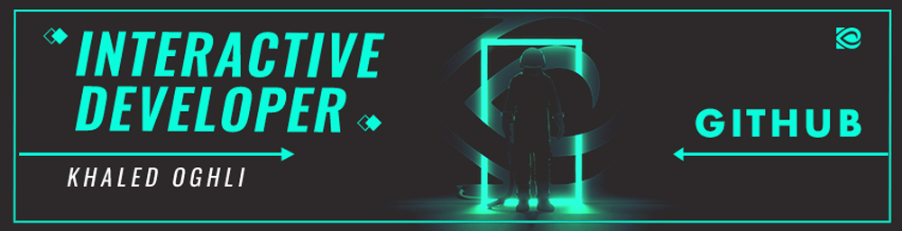

<h1>
  Hi 👋, I'm Khaled Oghli
      Front End Web Developer
    

  

  

</h1>

 

  

- 🔭 I’m currently working on [Dubai Municipality Building Permit Control System](https://www.dm.gov.ae/)

- 👨‍💻 All of my projects are available at [https://www.khaledoghli.com](https://www.khaledoghli.com)

- 💬 Ask me about **HTML, CSS, Vue and web animation**

- 📫 How to reach me **khaledoghli@outlook.com**

<!-- <h3 align="left">Languages and Tools:</h3> -->
# 🔧 Technologies & Tools 

 

    
    
    
    
    
    
    
    
    
    
    
    
    
    
    
    
    
    
    
    
    
    
    
    
    
    
    
    
    
    
    
    
    

  
    
  

 

##  For More Information, Please Check Out or Connect Me Via

   &nbsp;&nbsp;
  
   &nbsp;&nbsp;
  
   &nbsp;&nbsp;
  
   &nbsp;&nbsp;
  
   &nbsp;&nbsp;

 

 
