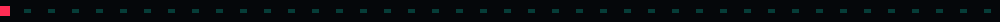
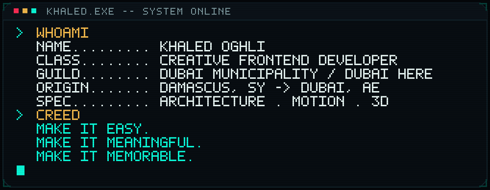
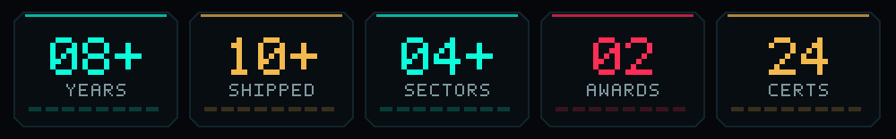
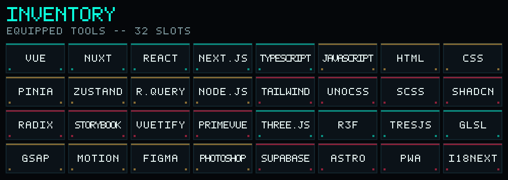
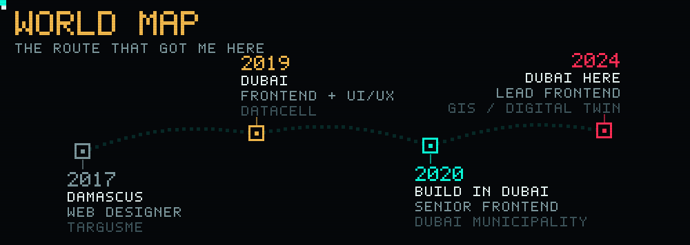

<!--
  ╔═══════════════════════════════════════════════════════════════════════╗
  ║  KHALED OGHLI  PROFILE README                                        ║
  ║  Repo: github.com/khaledOghli/khaledOghli                             ║
  ║                                                                       ║
  ║  All the pixel art in this file is hand-generated SVG (5x7 bitmap     ║
  ║  font, brand palette from the portfolio's tokens.css).                ║
  ║  Regenerate after editing copy:  node tools/build-art.mjs             ║
  ╚═══════════════════════════════════════════════════════════════════════╝
-->

> I was born in Damascus, I live in Dubai now, and somewhere between those two places I became
> the kind of person who cares deeply about how digital experiences feel. I started with design,
> grew into front-end, and slowly found out that the details most people barely notice are usually
> the ones I care about most. I care about systems and clean execution  but I never want the work
> to feel cold. Every product should carry a visible trace of the person who built it.

<b>&nbsp;▸ &nbsp;Open the full repertoire</b>

 
| Domain | Tools |
|:--|:--|
| Architecture | React · Hooks · Vue 3 · Composition API · Next.js · Nuxt.js · TypeScript · Pinia · Vuex · React Query · Zustand · Redux · VueUse |
| Design Systems | Tailwind CSS · UnoCSS · SCSS · BEM · Storybook · shadcn/ui · Radix · Vuetify · PrimeVue · Material UI |
| Creative | Three.js · React Three Fiber · TresJS · WebGL · GLSL · Shaders · Blender · Art direction |
| Motion | GSAP · ScrollTrigger · Motion · Scroll sequences · Micro-interactions · Easing & timing |
| A11y & SEO | WCAG · ARIA · Keyboard nav · Screen readers · Focus management · Structured data · Open Graph · react-i18next |
| Design | Figma · Photoshop · Wireframes · Prototyping · Design tokens · Type scales · Color systems |
| Platform | Node.js · Supabase · Astro · Jamstack · Auth · Recharts · PWA · Vercel · Serwist |

<samp>SAVE DATA</samp>

<b>&nbsp;▸ &nbsp;SIDE QUESTS  where the ideas actually come from</b>

 
🎮 Games  part of my life since the PS1 days. When I play I'm not just a gamer; I'm studying how immersion, pacing and satisfying interactions should feel.
 <samp>Baldur's Gate 3 · Divinity: Original Sin 2 · Batman: Arkham · Deus Ex · Silent Hill · Resident Evil · Ninja Gaiden · The King of Fighters · Digimon World</samp>
🎬 Cinema & series  a lot of how I think about contrast, pacing, tension and visual weight comes from the screen as much as from design.
🧭 Creative browsing  studio sites, portfolios, experimental work. It keeps reminding me there's a huge difference between a page that functions and a page that leaves a feeling.
📚 Reading
| Cleared | Queued |
|:--|:--|
| Eloquent JavaScript | Fluent React |
| JavaScript: The Definitive Guide | Building Micro-Frontends |
| The Design of Everyday Things | Fundamentals of Software Architecture |
| HTML & CSS / JS & jQuery (where it started) | Refactoring |
👨‍👩‍👧 Family  the one thing I never trade for a deadline, and the reason the rest of it is worth doing.

<b>&nbsp;▸ &nbsp;NEXT LEVEL  the direction I'm still walking toward</b>

 
+ Grow deeper into creative development, where taste, motion, story and
+ engineering stop being separate jobs
+ Go further into 3D on the web  not as a technical flex, only where it
+ makes something faster to understand or better to sit inside
+ Build products that feel premium in motion, not just in screenshots
! Long term: someone opens a site and recognises it as mine before they
! ever see my name on it

  
<samp><i>“Where the human heart meets the digital mind.”</i></samp>

